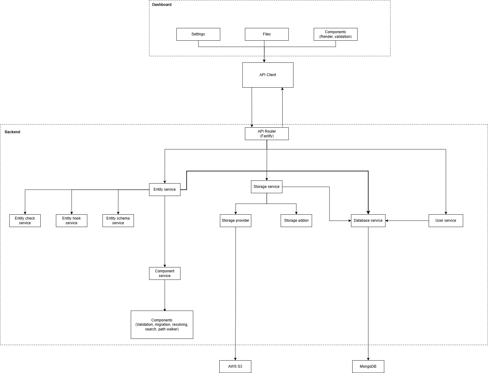

# game-cms

A headless CMS for **game content** — spritesheets, Spine skeletons, bitmap fonts, tilemaps, 3D models — with a fully typed TypeScript API and **no code generation step**.

> [!IMPORTANT]
> **This is a proof of concept**, built as a diploma project. It exists to explore one question: can a headless CMS give you end-to-end types _without_ generating code from a schema?
>
> The answer turned out to be "yes", and this repository is the evidence. It is **not** a product: it is unpublished and unversioned, and has no upgrade story, no security audit, and no stability guarantees. Read [Status & limitations](#status--limitations) before considering it for anything real.

## Motivation

The question came out of typing. Every CMS I looked at had decent TypeScript support, but all of them relied on **source generation** — run a CLI, get a `types.d.ts`, remember to re-run it after every schema edit, keep the artifact in sync. That is a real cost: a build step, a stale-types failure mode, and generated code in your diff.

The domain came out of games. Game projects deal with data formats that web-oriented CMSs (WordPress, Directus, Strapi, Sanity) have no concept of. A Spine animation, for instance, is not a file — it is a small graph:

```
skeleton (animation.json)
    └── atlas (animation.atlas)
            ├── animation1.png
            └── animation2.png
```

Describing that relationship in a traditional CMS means either three unrelated file fields and a convention nobody enforces, or a custom internal tool. So content designers end up in spreadsheets and shared folders, and every content change becomes an engineering task.

## The core idea: types without codegen

Define an entity as a plain value:

```ts
// hero.ts

import { entity } from 'game-cms';
import { compose, file, number, repeatable, text } from 'game-cms/components';

export default entity({
  title: 'Hero',
  components: {
    name: text(),
    frameWidth: number({ integer: true, min: 1 }),
    frameHeight: number({ integer: true, min: 1 }),
    hp: number({ integer: true, min: 1 }),
    speed: number({ min: 0 }),
    jumpForce: number({ min: 0 }),
    animations: repeatable({
      component: compose({
        state: text(),
        sprite: file({ supportedMimeTypes: ['image/png'], maxItems: 1 }),
      }),
    }),
  },
});
```

Collect the entities in a registry, where the export name _is_ the entity id:

```ts
// registry.ts

export { default as 'hero' } from './hero.js';
```

Then declare the registry once, via module augmentation:

```ts
// types.ts

import type { ResolveEntityRegistryData } from 'game-cms';

type Registry = typeof import('./registry.js');

declare module 'game-cms' {
  interface EntityTypeRegistry {
    ids: keyof Registry;
  }

  interface EntityTypeDataRegistry extends ResolveEntityRegistryData<Registry> {}
}
```

That stub is the entire "generation" step, and it never changes as you add entities. From here the compiler does the work:

```ts
import { EntityOutDataById } from 'game-cms';

type Hero = EntityOutDataById<'hero'>;
// { name: string; frameWidth: number; ...
//   animations: { state: string; sprite: FileOutData[] }[] }
```

And every API surface that touches entities is typed — entity ids are a union, the returned data is the entity's actual shape, no `any` and no `unknown`:

```ts
const result = await cms()
  .service('base::entity')
  .getResolvedById('hero', id, {}, 'published');
```

Adding a field to `hero.ts` immediately changes `Hero` everywhere. Nothing to re-run, nothing to commit.

## Data types

It may seem that an entity has only one type, but it doesn't. Consider this entity:

```ts
export default entity({
  title: 'Test',
  components: {
    a: date(),
  },
});
```

On the frontend the type is obviously `{ a: Date }`. But it also has to travel to the backend as JSON, so it becomes `{ a: string }`. Then it has to be stored — `{ a: number }` if you represent it as epoch seconds, or `{ a: Date }` for Postgres or MongoDB.

A file is a more interesting example:

```ts
export default entity({
  title: 'Test',
  components: {
    image: file(),
  },
});
```

Files are best stored in their own collection and referenced by id from the entity, so _creating or updating_ the entity takes `{ image: string }`. But when you _read_ the entity back, an id alone is useless — you need the URL, the MIME type, the size. So reading gives you something like `{ image: { id: string; url: string; mime: string; size: number } }`.

Rather than declaring that "a date is a string, a number, or a `Date`, depending", each component declares a distinct type per stage:

| Kind             | When it applies                                        |
| ---------------- | ------------------------------------------------------ |
| **Out**          | Reading entity data out of the API                     |
| **In**           | Sending entity data to the API                         |
| **Storage**      | The shape persisted in / read from the database        |
| **Client**       | The shape held by the dashboard's React editors        |
| **Search index** | Auxiliary data persisted to make search cheap          |
| **Resolved**     | Out data, reshaped by arguments passed at request time |

The conversions between them are explicit — a component supplies a `storageTransformer` and a `clientTransformer` — and the round-trip `out → client → in → storage → out` is what the component e2e tests exercise.

## Component system

A component is the unit of everything: it owns an id, a validator, a default value, a migration, its transformers, and its React editor. Entities are just named maps of components, and components nest arbitrarily.

They fall into three groups:

| Containers (hold arbitrary components) | Primitives (indivisible values) | Complex (fixed inner structure) |
| -------------------------------------- | ------------------------------- | ------------------------------- |
| `compose`                              | `text`                          | `file`                          |
| `alternative`                          | `number`                        | `font`                          |
| `repeatable`                           | `checkbox`                      | `entityReference`               |
| `dynamicZone`                          | `date`                          |                                 |
| `graph`                                | `dropdown`                      |                                 |
|                                        | `json`                          |                                 |

Game-specific components ship separately, in `@game-cms/game-plugin`:

| Component                       | What it models                                                          |
| ------------------------------- | ----------------------------------------------------------------------- |
| `spine`                         | Skeletal animation: skeleton + atlas + textures, with preview rendering |
| `spritesheet`                   | Texture plus JSON atlas; packed via Sharp, validated via PixiJS         |
| `spriteStripe`                  | A strip of equally-sized frames                                         |
| `bitmapFont`                    | SDF bitmap font: metadata + texture                                     |
| `threeDModel`                   | GLB (glTF binary) models                                                |
| `tileGrid`, `resizableTileGrid` | Tilemap authoring on top of a tileset                                   |
| `assetWrapper`                  | Shared plumbing for the multi-file asset components above               |

## Architecture



The backend is Fastify. Everything behind the router is a **service**, addressed by a string id and resolved through a global controller (`cms().service('base::entity')`) — `base::entity`, `base::storage`, `base::component`, `base::database`, `base::user`, `base::auth`, `base::entity::search`, `base::entityHook`, `base::entityCheck`, and so on. Services are contributed by plugins, so the id union grows with what you install.

Storage sits behind a **provider** interface with local-filesystem and S3-compatible implementations, plus **addons** that post-process uploads (image dimensions, responsive variants). Uploads stream through the CMS into the provider; reads from a private S3 bucket are handed out as presigned URLs. Files live in their own hierarchy of folders, and **file tracing** records which entities reference which files.

MongoDB is the database — being a document store means arbitrary entity shapes need no migrations when a schema changes, though the CMS has its own migration mechanism for when data does need rewriting.

The dashboard is a React Router app that talks to the same REST API through a typed client, and renders each component's editor from the plugin that contributed it.

Entities are versioned as **draft / published**: edits always land in the draft, publishing promotes it, and `entity checks` (custom validators) and `entity hooks` (webhooks) fire around that transition.

## Repository layout

```
packages/          the CMS itself (~29 workspace packages)
demo-app/          minimal host app: S3 storage, entity checks, webhooks
demo-platformer/   the real demo — a Pixi.js platformer driven entirely by CMS content
docs/pitch/        thesis presentation (LaTeX) and diagrams
scripts/           monorepo tooling (lint, clean, e2e launcher, tsconfig deps)
__tests__/         tests over the monorepo structure itself
```

The packages worth knowing about:

| Package                                                             | Role                                                                                  |
| ------------------------------------------------------------------- | ------------------------------------------------------------------------------------- |
| `game-cms`                                                          | The public entry point + the `game-cms` CLI (`dev`, `build`, `start`, migrations)     |
| `@game-cms/core`                                                    | Core types: components, plugins, services, config                                     |
| `@game-cms/base-api`                                                | REST routes and the built-in services                                                 |
| `@game-cms/base-components`                                         | The 14 built-in components                                                            |
| `@game-cms/dashboard`                                               | The admin UI                                                                          |
| `@game-cms/ignition`                                                | Boots a CMS instance: resolves config, env, plugins, services                         |
| `@game-cms/game-plugin`                                             | Game asset components, previews, and pipelines                                        |
| `@game-cms/storage-provider-local` / `-s3`                          | Storage backends                                                                      |
| `@game-cms/storage-addons`                                          | Post-upload processing (image size, responsive images)                                |
| `@game-cms/spritesheet`                                             | Spritesheet packing algorithms                                                        |
| `@game-cms/conditional`                                             | Small expression language behind the `alternative` component (parser, AST, evaluator) |
| `@game-cms/entity-checks`, `@game-cms/entity-previews`              | Pre-publish validation, live content previews                                         |
| `@game-cms/ui`                                                      | Shared component library (Storybook)                                                  |
| `@game-cms/testing-lib`, `-/component-testing-lib`, `@game-cms/e2e` | Test harnesses                                                                        |

## Running it

Requirements: Node 24+, pnpm 11, Docker (for MongoDB).

```bash
pnpm install
pnpm prebuild   # builds codegen, per-package prebuilds, then tsc --build
```

`prebuild` is not optional — the workspace packages are consumed from `dist`, so a fresh checkout will not typecheck until it has run once. Use `pnpm prebuild:watch` while developing.

### The platformer demo

The most complete example. A Pixi.js platformer whose heroes, traps, items, rooms, and levels are all CMS entities — the game ships with no content of its own.

Fully containerized:

```bash
cd demo-platformer
docker compose up --build
# CMS dashboard  -> http://localhost:3001   (admin@demo.app / admin)
# game           -> http://localhost:3000
```

Or run the pieces locally against a MongoDB container:

```bash
docker compose -f common-services.yml up -d      # MongoDB on :27017

pnpm --filter @demo-platformer/cms dev           # CMS + dashboard
pnpm --filter @demo-platformer/frontend dev      # Pixi.js game (Vite)
pnpm --filter @demo-platformer/backend dev       # serves/proxies the game
```

The CMS config lives in [demo-platformer/cms/src/cms.config.ts](demo-platformer/cms/src/cms.config.ts), the entities in [demo-platformer/cms/src/entities/](demo-platformer/cms/src/entities/), and the game design it implements is written up in [demo-platformer/abstract/game-concept.md](demo-platformer/abstract/game-concept.md).

### The minimal demo app

[demo-app/](demo-app/) is a smaller host that exercises S3 storage, storage addons, entity checks, and entity webhooks. It needs a `.env` next to `package.json`:

```
JWT_SECRET_KEY=...
S3_BUCKET=...
S3_API_URL=...
S3_ACCESS_KEY_ID=...
S3_SECRET_ACCESS_KEY=...
```

```bash
docker compose -f common-services.yml up -d
pnpm --filter demo-app dev
```

## Development

```bash
pnpm lint            # eslint + stylelint + prettier (pnpm lint:fix to autofix)
pnpm test            # unit tests           (*.test.ts)
pnpm test:browser    # component tests      (*.btest.tsx, Playwright/Chromium)
pnpm test:outer-loop # slow integration     (*.outer-loop-test.ts)
pnpm e2e:launch      # e2e in Docker        (*.e2e-test.ts, real CMS + MongoDB)
pnpm test:build      # verifies every package still builds
pnpm gen:ts-deps     # regenerates project references from package.json deps
```

The e2e suite boots an actual CMS against MongoDB and pushes every component through the full `out → client → in → storage → out` round trip, which is how the multi-representation typing above is kept honest.

The repository has its own Claude Code skills under [.claude/skills/](.claude/skills/) for the repetitive parts — adding a package, writing unit / service e2e / component e2e tests.

## Status & limitations

What works: the component system, the plugin architecture, the REST API, the dashboard, local and S3 storage, draft/publish with checks and hooks, search, migrations, and the game asset pipelines — enough that the platformer demo is genuinely content-driven.

What this is not:

- **Not published.** Nothing is on npm; everything is `workspace:*`. Version is `0.1.0` and means nothing.
- **Not stable.** APIs change whenever it's convenient. There is no deprecation policy and no changelog.
- **Not hardened.** Auth exists (JWT sessions, API tokens, permissions) but has had no security review. Demo credentials are hardcoded and demo JWT keys are committed on purpose — do not copy that pattern.
- **MongoDB only.** The storage layer is abstracted over components, not over databases.
- **Not benchmarked.** No load testing, no query-performance work, no caching layer.

The type system is also the honest weak point of the approach: replacing codegen with inference means deeply nested entities produce large conditional types, and TypeScript errors involving them are unpleasant to read. That is the trade the experiment makes — no build step, harder error messages.
